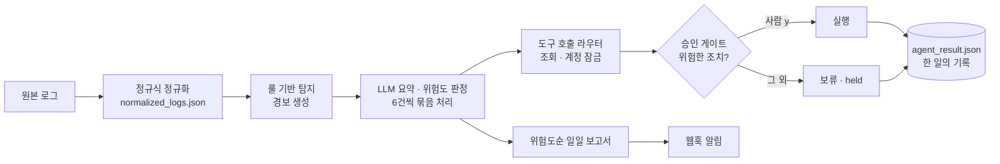

# 🛡️ agent_core — 보안 관제 자동화 에이전트


**로그 수집 → 정규화 → 룰 탐지 → LLM 요약 · 판단 → 도구 실행 → 사람 승인 → 보고서 · 알림**까지,
보안 관제의 한 사이클을 파이썬으로 직접 구현한 프로젝트입니다.

> 핵심 원칙은 하나입니다. **LLM 은 고르기만 하고, 실행은 코드가 하고, 되돌리기 어려운 결정은 사람이 합니다.**

```console
$ python pipeline.py
[보고서] daily_report_20261008.md 저장 · 사람 확인 필요 1건
```

---

## 전체 구조



## 무엇을 할 수 있나

| 단계 | 하는 일 | 핵심 기술 |
|---|---|---|
| **1. 로그 정규화** | 제각각인 원본 로그 줄을 사용자 · 등급 · 시간 필드가 있는 JSON 으로 바꾼다 | 정규표현식, `json` |
| **2. 룰 기반 탐지** | 로그인 실패 반복 · 설정 변경 · 새 IP 로그인 같은 룰로 경보를 만든다 | 반복문 · 조건문, 딕셔너리 |
| **3. 외부 API 연동** | IP 의 국가 · 통신사를 조회한다. LLM 이 지어내지 않도록 사실은 코드가 확인한다 | `requests`, 상태 코드 처리 |
| **4. LLM 클라이언트** | Gemini 를 호출하고 답을 딕셔너리로 읽는다. 코드 블록이 붙거나 JSON 이 깨져도 죽지 않는다 | REST API, 응답 검증 |
| **5. 경보 요약 · 보고서** | 경보를 묶음으로 나눠 요약하고, 위험도순으로 정렬해 보고서를 만든다 | 프롬프트 설계, 묶음 처리 |
| **6. 도구 호출 에이전트** | LLM 이 고른 도구 이름을 레지스트리에서 찾아 실행한다. 없는 이름은 알리고 넘어간다 | tool calling, 라우터 패턴 |
| **7. 사람 승인 게이트** | 계정 잠금 같은 위험한 도구는 담당자가 `y` 할 때만 실행하고, 아니면 `held` 로 기록한다 | human-in-the-loop |
| **8. 알림 · 파이프라인** | 설정 → 보고서 → 건수 → 알림을 한 번에 잇는다. 알림이 실패해도 보고서는 남는다 | 웹훅, `try / except`, 오케스트레이션 |
| **9. 품질 관리** | 설정 분리, 코드 리뷰 체크리스트, 단위 테스트로 고칠 때마다 확인한다 | `config.json`, `assert` |

## 설계 원칙

| 원칙 | 어떻게 구현했나 |
|---|---|
| **판단은 LLM, 실행은 코드, 되돌리기 어려운 결정은 사람** | LLM 은 `{"tool": …, "args": …}` 를 고르기만 한다. 실행은 우리 코드가 하고, 계정 잠금은 승인 게이트를 거친다 |
| **사실은 코드가 확인한다** | 로그인 실패 횟수 · IP 정보 · high 건수는 도구와 코드가 센다. LLM 이 조회 없이 지어내는 값은 쓰지 않는다 |
| **LLM 의 답을 믿지 않고 검증한다** | JSON 이 아닌 답은 `None` 으로 처리하고 다음 단계를 계속한다. 목록에 없는 도구 이름은 실행하지 않는다. 위험도는 `.strip().lower()` 로 정규화 |
| **일부가 실패해도 전체는 계속된다** | 요청마다 `timeout`, 알림은 `try / except`. 실패는 숨기지 않고 `[알림 실패] ConnectionError` 로 출력한다 |
| **모르면 막는 쪽으로** | 처음 보는 위험도는 high 로 보고 사람에게 묻는다 |
| **설정과 코드의 분리** | 모델 · 승인 기준 · 폴더 · 알림 주소를 `config.json` 에 모았다. 비밀(API 키)은 `.env` 에만 두고 올리지 않는다 |
| **한 일을 기록으로 남긴다** | 에이전트가 처리한 목표 · 도구 · 결과를 `agent_result.json` 에 남긴다 |

## 빠른 시작

```bash
git clone https://github.com/mdkk0220/security-agent-toolkit.git
cd security-agent-toolkit/agent_core
pip install requests flask
```

Gemini API 키를 `.env` 에 넣습니다. **`.env` 는 커밋하지 않습니다.**
```
GEMINI_API_KEY=발급받은_키
```

```bash
python alert_server.py       # 터미널 1 — 알림을 받는 웹훅 서버 (5001 번)
python pipeline.py           # 터미널 2 — 보고서 생성 + 알림 전송
python test_agent_core.py    # 테스트 — [테스트 통과] 9건 모두
```

## 설정 (`config.json`)

```json
{
  "model": "gemini-3.5-flash-lite",
  "approve_severity": "high",
  "report_folder": "reports",
  "webhook_url": "http://127.0.0.1:5001/alert"
}
```

코드를 고치지 않고 이 파일만 바꿔 동작이 달라집니다. 예를 들어 `approve_severity` 를 `low` 로 바꾸면 「사람 확인 필요」가 전체 경보로 늘어납니다. 네 키 중 하나라도 없으면 `[설정 오류]` 를 출력하고 멈춥니다.

## 출력 예시

> 모양을 보여 주기 위한 예시입니다. 요약 문장과 위험도는 LLM 이 실행할 때마다 달라질 수 있습니다.

**일일 보고서** `daily_report_YYYYMMDD.md`
```markdown
# 야간 보안 관제 보고 (2026-10-08)

## 한눈에 보기
- 처리한 경보: 6건 (high 1건)

## 총평
(LLM 이 쓴 두세 문장)

## 건별 내역 (위험한 것부터)
- [HIGH] F01 admin 계정 탈취 의심
- [MEDIUM] F06 jung.hw 새 IP 로그인
- [LOW] F02 kim01 로그인 실패 1회
```
high 가 3건 이상이면 「한눈에 보기」 맨 위에 경고 줄이 자동으로 붙습니다.

**에이전트 기록** `agent_result.json`
```json
[
  {"goal": "admin 계정이 로그인에 몇 번 실패했는지 알려 주세요.", "tool": "count_failed_logins", "result": 4},
  {"goal": "admin 계정을 잠가 주세요.", "tool": "lock_account", "result": "held"}
]
```
승인받지 못한 위험한 조치는 실행하지 않고 `held` 로 남습니다.

## 저장소 구성

### 모듈
```
agent_core/
├── pipeline.py            # 진입점 — 설정 → 보고서 → 건수 → 알림
├── notifier.py            # 설정 검사 · 승인 필요 판정 · 알림 (실패해도 멈추지 않음)
├── llm_client.py          # LLM 호출 · 답을 JSON 으로 읽기
├── event_summarizer.py    # 경보 묶음 요약 · 위험도순 정렬
├── report_generator.py    # 총평 · 보고서 생성 · 저장
├── tool_router.py         # 도구 레지스트리 · 이름으로 찾아 실행
├── alert_server.py        # 알림을 받는 로컬 웹훅 서버 (Flask)
├── config.json            # 설정
└── test_agent_core.py     # 단위 테스트 (assert 9건)
```

### 개발 기록 (노트북)

만들어 가는 과정을 날짜별 실습 노트북으로 남겼습니다. 아래 순서대로 기능이 쌓여 위 구조가 됩니다.

| 시기 | 노트북 | 쌓은 것 |
|---|---|---|
| 9/23 ~ 9/29 | `260923_*` · `0928_*` · `0929_*` | 파이썬 기초 — 함수 · 반복 · 딕셔너리 · 예외 처리 · 룰 기반 탐지 |
| 9/30 | `0930_*` | `requests` 로 API 호출하는 클라이언트 |
| 10/2 | `1002_*` | 웹 서버(웹훅) · 스케줄러 · 파일 다루기 |
| 10/6 | `1006_*` · `261006_*` | LLM 프롬프트 · `llm_client` · 도구 호출 · 라우터 · 승인 게이트 |
| 10/7 | `261007_*` | 경보 묶음 요약 · 위험도 정렬 · 일일 보고서 |
| 10/8 | `1008_*` | 설정 분리 · 알림 연동 · 파이프라인 · 코드 리뷰 · 테스트 · 디버깅 |

## 알아 둘 점

- 무료 Gemini 키는 **1분에 15번**까지만 호출할 수 있고, 한 번 실행에 LLM 을 두 번 부릅니다. `429` 가 나오면 1분 뒤 다시 실행하세요.
- 알림 서버가 꺼져 있으면 `[알림 실패]` 가 출력되지만 보고서는 정상 저장됩니다.

## 개선 계획

- [ ] 도구 호출 에이전트(라우터 · 승인 게이트)를 `pipeline.py` 에 연결 — 보고서 단계에서 바로 조치까지
- [ ] 알림을 실제 메신저(슬랙 · 팀즈) 웹훅으로 교체
- [ ] 알림 실패 메시지를 파일에 쌓아 두었다가 재전송
- [ ] 보고서를 `report_folder` 에 날짜별로 자동 정리
- [ ] 스케줄러로 매일 아침 자동 실행
